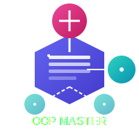

# OOP Master

An interactive learning platform for mastering Object-Oriented Programming concepts through visual understanding.

<p align="center">
  
</p>

## About

OOP Master is a modern web application designed to make learning Object-Oriented Programming intuitive and engaging. Through interactive visualizations, clear code examples, and step-by-step explanations, users can gain a deep understanding of OOP principles and apply them in their own projects.

## Features

- **Interactive Learning Modules** - Comprehensive coverage of all OOP pillars:
  - Classes & Objects
  - Encapsulation
  - Inheritance
  - Polymorphism
  - Abstraction

- **Multi-language Support** - Code examples in multiple programming languages:
  - TypeScript
  - JavaScript
  - Python
  - Java

- **Interactive Demonstrations** - Hands-on learning with:
  - Object simulators
  - Inheritance visualizers
  - Polymorphism workshops
  - Abstraction designers

- **Modern UI/UX** - Elegant and user-friendly experience:
  - Responsive design for all devices
  - Dark and light theme support
  - Animated visualizations
  - Intuitive navigation

- **Learning Resources** - Additional tools to aid understanding:
  - Visual diagrams
  - In-depth explanations
  - External reference links
  - Code playgrounds

## Screenshots

*Coming soon*

## Getting Started

### Prerequisites

- Node.js 18.0 or later
- npm or yarn

### Installation

1. Clone the repository:
   ```bash
   git clone https://github.com/ozidan13/OOP.git
   cd OOP
   ```

2. Install dependencies:
   ```bash
   npm install
   # or
   yarn install
   ```

3. Run the development server:
   ```bash
   npm run dev
   # or
   yarn dev
   ```

4. Open [http://localhost:3000](http://localhost:3000) with your browser to see the result.

## Project Structure

```
/
├── app/                # Next.js app directory
│   ├── (modules)/      # Learning module pages
│   ├── page.tsx        # Landing page
│   └── ...
├── components/         # Reusable React components
├── lib/                # Utility functions and contexts
├── public/             # Static assets
│   ├── logo.svg        # OOP Master logo
│   └── oop_content.json # Module content
└── ...
```

## Tech Stack

- **Framework**: Next.js 14 (App Router)
- **Language**: TypeScript
- **Styling**: Tailwind CSS
- **Icons**: Font Awesome
- **Animation**: CSS transitions and keyframes
- **State Management**: React Context API

## Contributing

Contributions are welcome! Feel free to open issues or submit pull requests.

## License

This project is licensed under the MIT License - see the LICENSE file for details.

## Acknowledgments

- Inspired by best practices in educational web design
- Built with a focus on visual learning and interactivity
- Special thanks to the React and Next.js communities

## Contact

Osama Zinhom - osamazinhomzidan@gmail.com
